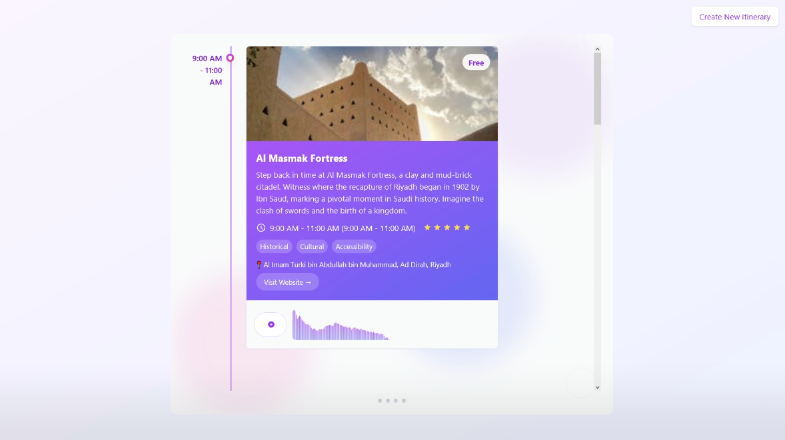

<div id="top">

<!-- HEADER STYLE: CLASSIC -->
<div align="center">


# AURORA-AI-TRIP-SCHEDULER

<em>Your world, explored. Every journey, perfectly planned.</em>

<!-- BADGES -->


<em>Built with the tools and technologies:</em>


<br>


</div>
<br>

---

## 📄 Table of Contents

- [📄 Table of Contents](#-table-of-contents)
- [✨ Overview](#-overview)
- [📌 Features](#-features)
- [📁 Project Structure](#-project-structure)
  - [📑 Project Index](#-project-index)
- [🚀 Getting Started](#-getting-started)
  - [📋 Prerequisites](#-prerequisites)
  - [⚙ ️ Installation](#-installation)
  - [💻 Usage](#-usage)
  - [🧪 Testing](#-testing)
- [📈 Roadmap](#-roadmap)
- [🤝 Contributing](#-contributing)
- [📜 License](#-license)
- [✨ Acknowledgments](#-acknowledgments)

---

## ✨ Overview

Aurora is an AI-powered travel itinerary platform designed to generate personalized, multi-stop trips complete with immersive audio narrations and contextual imagery. Built on a decoupled full-stack architecture, the project uses a Python/Flask backend to orchestrate API integrations (Google Gemini, ElevenLabs, Pexels) and a React (Vite) frontend to deliver a smooth, interactive user experience.



---

## 📌 Features

| Component | Details |
| :--- | :--- |
| 🧠 **Generative AI Engine** | Integrates the Google Gemini SDK to process user preferences and generate structured, context-aware travel itineraries. |
| 🎙️ **Audio-Visual Narration** | Utilizes ElevenLabs to generate text-to-speech voiceovers for each location, paired with a real-time, animated audio visualizer component. |
| 🖼️ **Dynamic Imagery** | Automatically fetches high-quality, location-specific photos via the Pexels API to enrich the visual timeline. |
| ⚛️ **Modern React Frontend** | Built with Vite and React 18, utilizing `shadcn/ui`, Radix UI primitives, and Tailwind CSS for an accessible, composable design system. |
| 🎞️ **Interactive Timeline UI** | Features a vertically scrollable, card-based itinerary visualization with scroll-snapping, fluid Framer Motion animations, and a persistent "AI Tour Guide" avatar overlay. |
| 🔌 **RESTful Architecture** | Maintains a strict separation of concerns, connecting the frontend to the Flask orchestrator via highly decoupled Axios API calls. |

---

## 📁 Project Structure

```sh
└── Aurora-AI-Trip-Scheduler/
    ├── Aurora Backend.py
    ├── frontend
    │   ├── README.md
    │   ├── components.json
    │   ├── eslint.config.js
    │   ├── index.html
    │   ├── jsconfig.json
    │   ├── package-lock.json
    │   ├── package.json
    │   ├── postcss.config.js
    │   ├── public
    │   ├── src
    │   ├── tailwind.config.js
    │   └── vite.config.js
    └── requirements.txt
```

### 📑 Project Index

<details open>
        <summary><b><code>AURORA-AI-TRIP-SCHEDULER/</code></b></summary>
        <!-- __root__ Submodule -->
        <details>
                <summary><b>__root__</b></summary>
                <blockquote>
                        <div class='directory-path' style='padding: 8px 0; color: #666;'>
                                <code><b>⦿ __root__</b></code>
                        <table style='width: 100%; border-collapse: collapse;'>
                        <thead>
                                <tr style='background-color: #f8f9fa;'>
                                        <th style='width: 30%; text-align: left; padding: 8px;'>File Name</th>
                                        <th style='text-align: left; padding: 8px;'>Summary</th>
                                </tr>
                        </thead>
                                <tr style='border-bottom: 1px solid #eee;'>
                                        <td style='padding: 8px;'><b><a href='https://github.com/omarg-dev/Aurora-AI-Trip-Scheduler/blob/master/Aurora Backend.py'>Aurora Backend.py</a></b></td>
                                        <td style='padding: 8px;'>- Serves as the core backend engine for Aurora, a personalized travel itinerary platform<br>- Orchestrates communication between Google Gemini for AI-generated travel plans, ElevenLabs for narrative voiceovers, and Pexels for location imagery<br>- Exposes a REST API endpoint that accepts traveler preferences and returns a fully enriched, multi-stop itinerary complete with audio narrations, photos, and structured location details.</td>
                                </tr>
                                <tr style='border-bottom: 1px solid #eee;'>
                                        <td style='padding: 8px;'><b><a href='https://github.com/omarg-dev/Aurora-AI-Trip-Scheduler/blob/master/requirements.txt'>requirements.txt</a></b></td>
                                        <td style='padding: 8px;'>- Defines the external dependencies required to run the backend service, ensuring all necessary libraries are installed for the application to function correctly<br>- Covers web framework support via Flask, cross-origin request handling, environment variable management, HTTP communication, and AI-powered features through Googles Generative AI SDK<br>- Installing these packages establishes the foundational environment needed for the full application stack to operate seamlessly.</td>
                                </tr>
                        </table>
                </blockquote>
        </details>
        <!-- frontend Submodule -->
        <details>
                <summary><b>frontend</b></summary>
                <blockquote>
                        <div class='directory-path' style='padding: 8px 0; color: #666;'>
                                <code><b>⦿ frontend</b></code>
                        <table style='width: 100%; border-collapse: collapse;'>
                        <thead>
                                <tr style='background-color: #f8f9fa;'>
                                        <th style='width: 30%; text-align: left; padding: 8px;'>File Name</th>
                                        <th style='text-align: left; padding: 8px;'>Summary</th>
                                </tr>
                        </thead>
                                <tr style='border-bottom: 1px solid #eee;'>
                                        <td style='padding: 8px;'><b><a href='https://github.com/omarg-dev/Aurora-AI-Trip-Scheduler/blob/master/frontend/package-lock.json'>package-lock.json</a></b></td>
                                        <td style='padding: 8px;'>UI & Styling<strong> — Radix UI primitives, <code>clsx</code>, and <code>class-variance-authority</code> for building a consistent, accessible component system-</strong>Animations<strong> — <code>framer-motion</code> for delivering smooth, interactive trip-planning UI experiences-</strong>HTTP Communication<strong> — <code>axios</code> for managing API calls between the frontend and backend services (likely AI trip scheduling endpoints)## Why It MattersBy locking dependency versions at the project level, this file:-Guarantees </strong>reproducible builds<strong> across all environments-Prevents </strong>dependency drift<strong> that could introduce bugs or breaking changes-Acts as the </strong>source of truth<strong> for auditing third-party packages used in the frontendThis file should always be </strong>committed to version control** and updated intentionally when dependencies are added or upgraded.</td>
                                </tr>
                                <tr style='border-bottom: 1px solid #eee;'>
                                        <td style='padding: 8px;'><b><a href='https://github.com/omarg-dev/Aurora-AI-Trip-Scheduler/blob/master/frontend/vite.config.js'>vite.config.js</a></b></td>
                                        <td style='padding: 8px;'>- Configures the Vite build tool for the React-based frontend, establishing the foundational development and production build environment<br>- Enables React support through the official Vite plugin and defines a path alias that maps the shorthand symbol to the source directory, streamlining module imports across the entire frontend codebase and ensuring consistent, maintainable references throughout the applications component and utility structure.</td>
                                </tr>
                                <tr style='border-bottom: 1px solid #eee;'>
                                        <td style='padding: 8px;'><b><a href='https://github.com/omarg-dev/Aurora-AI-Trip-Scheduler/blob/master/frontend/jsconfig.json'>jsconfig.json</a></b></td>
                                        <td style='padding: 8px;'>- Configuration establishing path alias mappings for the frontend application, enabling cleaner and more maintainable import statements throughout the codebase<br>- By defining a shorthand alias, developers can reference source files using a simplified syntax rather than complex relative paths, improving code readability and reducing errors when reorganizing the projects directory structure.</td>
                                </tr>
                                <tr style='border-bottom: 1px solid #eee;'>
                                        <td style='padding: 8px;'><b><a href='https://github.com/omarg-dev/Aurora-AI-Trip-Scheduler/blob/master/frontend/components.json'>components.json</a></b></td>
                                        <td style='padding: 8px;'>- Configuration manifest for the shadcn/ui component library integration within the frontend layer<br>- Establishes foundational design system settings including Tailwind CSS bindings, path aliases for streamlined component imports, and Lucide as the icon library<br>- Ensures consistent styling conventions and directory resolution across the frontend codebase, enabling developers to scaffold and maintain UI components with a unified, predictable structure.</td>
                                </tr>
                                <tr style='border-bottom: 1px solid #eee;'>
                                        <td style='padding: 8px;'><b><a href='https://github.com/omarg-dev/Aurora-AI-Trip-Scheduler/blob/master/frontend/postcss.config.js'>postcss.config.js</a></b></td>
                                        <td style='padding: 8px;'>- Configuration for the frontends CSS processing pipeline, enabling Tailwind CSS utility classes and automatic vendor prefixing across all stylesheets<br>- Serving as a foundational build step, it ensures consistent styling behavior across different browsers while allowing the frontend layer to fully leverage Tailwinds design system<br>- This setup seamlessly integrates with the broader frontend architecture to streamline UI development and maintainability.</td>
                                </tr>
                                <tr style='border-bottom: 1px solid #eee;'>
                                        <td style='padding: 8px;'><b><a href='https://github.com/omarg-dev/Aurora-AI-Trip-Scheduler/blob/master/frontend/index.html'>index.html</a></b></td>
                                        <td style='padding: 8px;'>- Serves as the foundational HTML entry point for the React-based frontend application, establishing the root DOM element where the entire UI renders and bootstrapping the Vite-powered module system<br>- Acting as the bridge between the browser and the React component tree, it ensures the application loads correctly across devices through proper viewport and character encoding configurations.</td>
                                </tr>
                                <tr style='border-bottom: 1px solid #eee;'>
                                        <td style='padding: 8px;'><b><a href='https://github.com/omarg-dev/Aurora-AI-Trip-Scheduler/blob/master/frontend/tailwind.config.js'>tailwind.config.js</a></b></td>
                                        <td style='padding: 8px;'>- Configures Tailwind CSS for the frontend application, establishing the design systems foundational styling rules<br>- Defines dark mode behavior, specifies which source files Tailwind should scan for class usage, and extends the default theme with custom CSS variable-driven border radii<br>- The animation plugin is included to support dynamic UI transitions, ensuring a consistent and flexible visual layer across the frontend.</td>
                                </tr>
                                <tr style='border-bottom: 1px solid #eee;'>
                                        <td style='padding: 8px;'><b><a href='https://github.com/omarg-dev/Aurora-AI-Trip-Scheduler/blob/master/frontend/package.json'>package.json</a></b></td>
                                        <td style='padding: 8px;'>- Defines the frontend applications identity, dependencies, and build configuration for the Aurora AI Trip Scheduler<br>- Serving as the foundation of the React-based client layer, it orchestrates the tooling ecosystem using Vite, TailwindCSS, Framer Motion, and Radix UI to power the user interface, while establishing development, build, and preview workflows that connect the frontend to the broader full-stack architecture.</td>
                                </tr>
                                <tr style='border-bottom: 1px solid #eee;'>
                                        <td style='padding: 8px;'><b><a href='https://github.com/omarg-dev/Aurora-AI-Trip-Scheduler/blob/master/frontend/eslint.config.js'>eslint.config.js</a></b></td>
                                        <td style='padding: 8px;'>- Defines the ESLint configuration for the frontend codebase, enforcing consistent code quality and best practices across all JavaScript and JSX files<br>- Tailored for a React 18 environment, it integrates recommended rules for core JavaScript, React, React Hooks, and React Refresh, ensuring developers maintain clean, standards-compliant code while supporting fast refresh workflows during development.</td>
                                </tr>
                        </table>
                        <!-- src Submodule -->
                        <details>
                                <summary><b>src</b></summary>
                                <blockquote>
                                        <div class='directory-path' style='padding: 8px 0; color: #666;'>
                                                <code><b>⦿ frontend.src</b></code>
                                        <table style='width: 100%; border-collapse: collapse;'>
                                        <thead>
                                                <tr style='background-color: #f8f9fa;'>
                                                        <th style='width: 30%; text-align: left; padding: 8px;'>File Name</th>
                                                        <th style='text-align: left; padding: 8px;'>Summary</th>
                                                </tr>
                                        </thead>
                                                <tr style='border-bottom: 1px solid #eee;'>
                                                        <td style='padding: 8px;'><b><a href='https://github.com/omarg-dev/Aurora-AI-Trip-Scheduler/blob/master/frontend/src/App.css'>App.css</a></b></td>
                                                        <td style='padding: 8px;'>- Defines the core visual styling for the applications timeline feature, establishing the layout, color palette, and interactive behavior of timeline components<br>- Covers scrollable containers, animated cards, date indicators, and decorative elements like dots and connecting lines<br>- Uses a cohesive purple-toned theme to create a polished, consistent user experience across the timeline view within the frontend interface.</td>
                                                </tr>
                                                <tr style='border-bottom: 1px solid #eee;'>
                                                        <td style='padding: 8px;'><b><a href='https://github.com/omarg-dev/Aurora-AI-Trip-Scheduler/blob/master/frontend/src/TourGuide.jsx'>TourGuide.jsx</a></b></td>
                                                        <td style='padding: 8px;'>- Serves as the interactive AI tour guide avatar component within the frontend, providing users with an animated, conversational interface that delivers location-specific information<br>- Positioned as a persistent UI overlay, it combines animated avatar states with a typing effect to simulate a responsive guide experience, enhancing user engagement as they explore different locations across the application.</td>
                                                </tr>
                                                <tr style='border-bottom: 1px solid #eee;'>
                                                        <td style='padding: 8px;'><b><a href='https://github.com/omarg-dev/Aurora-AI-Trip-Scheduler/blob/master/frontend/src/index.css'>index.css</a></b></td>
                                                        <td style='padding: 8px;'>- Establishes the global styling foundation for the frontend application by integrating Tailwind CSSs core directive layers, including base resets, reusable component styles, and utility classes<br>- A custom CSS variable for border radius is defined at the root level, ensuring consistent UI rounding across the interface<br>- This serves as the central entry point for all visual styling consumed throughout the React frontend.</td>
                                                </tr>
                                                <tr style='border-bottom: 1px solid #eee;'>
                                                        <td style='padding: 8px;'><b><a href='https://github.com/omarg-dev/Aurora-AI-Trip-Scheduler/blob/master/frontend/src/main.jsx'>main.jsx</a></b></td>
                                                        <td style='padding: 8px;'>- Entry point for the React frontend application, responsible for bootstrapping and mounting the root App component into the browsers DOM<br>- Wrapped in Reacts StrictMode to encourage best practices and surface potential issues during development, it serves as the foundation that initializes the entire client-side experience, connecting the application's component tree to the HTML document.</td>
                                                </tr>
                                                <tr style='border-bottom: 1px solid #eee;'>
                                                        <td style='padding: 8px;'><b><a href='https://github.com/omarg-dev/Aurora-AI-Trip-Scheduler/blob/master/frontend/src/Timeline.jsx'>Timeline.jsx</a></b></td>
                                                        <td style='padding: 8px;'>- Timeline.jsx — Summary## Purpose<code>Timeline.jsx</code> serves as the <strong>primary itinerary visualization component</strong> within the frontend, acting as the central display layer for presenting scheduled travel or event data in a structured, interactive timeline format.## Role in ArchitectureThis component sits at the <strong>presentation tier</strong> of the frontend, consuming processed itinerary data passed down from parent components or a data-fetching layer<br>- It bridges the gap between raw itinerary data and the user-facing experience by rendering schedule items as navigable, animated cards.## Key Responsibilities-<strong>Itinerary Rendering</strong> — Displays structured schedule/itinerary data (<code>itineraryData</code>) as a vertically scrollable, card-based timeline-<strong>State & Loading Management</strong> — Handles loading and error states gracefully, ensuring a resilient user experience across all data conditions-<strong>Scroll Navigation</strong> — Implements snap-style scroll behavior, guiding users through timeline entries one card at a time in a focused, paginated manner-<strong>Audio Coordination</strong> — Manages synchronized audio playback state across timeline cards, ensuring only one audio source plays at a time via <code>currentPlayingAudio</code> state-<strong>Animation</strong> — Leverages <code>framer-motion</code> to deliver smooth, polished card transitions that enhance the storytelling feel of the itinerary## Relationship to Other Components-Consumes the <strong><code>AudioVisualizer</code></strong> component to pair visual audio feedback with individual timeline entries-Utilizes shared <strong><code>Card</code></strong> UI primitives from the component library for consistent styling-Acts as a <strong>consumer component</strong>, expecting itinerary data to be sourced and passed in externally, keeping data-fetching concerns separated</td>
                                                </tr>
                                                <tr style='border-bottom: 1px solid #eee;'>
                                                        <td style='padding: 8px;'><b><a href='https://github.com/omarg-dev/Aurora-AI-Trip-Scheduler/blob/master/frontend/src/App.jsx'>App.jsx</a></b></td>
                                                        <td style='padding: 8px;'>- The trip planning form and the generated itinerary timeline<br>- By tracking whether an itinerary has been created, it seamlessly transitions users from input to visualization using animated view switching, while providing an option to return and create a new itinerary.</td>
                                                </tr>
                                                <tr style='border-bottom: 1px solid #eee;'>
                                                        <td style='padding: 8px;'><b><a href='https://github.com/omarg-dev/Aurora-AI-Trip-Scheduler/blob/master/frontend/src/TripForm.jsx'>TripForm.jsx</a></b></td>
                                                        <td style='padding: 8px;'>- A multi-step wizard form serving as the primary user-facing entry point for trip planning<br>- Guides users through collecting key travel preferences — destination, group size, time slot, interests, and additional options like budget and accessibility — before triggering an itinerary generation request to the backend API and passing the result back to the parent application for display.</td>
                                                </tr>
                                        </table>
                                        <!-- styles Submodule -->
                                        <details>
                                                <summary><b>styles</b></summary>
                                                <blockquote>
                                                        <div class='directory-path' style='padding: 8px 0; color: #666;'>
                                                                <code><b>⦿ frontend.src.styles</b></code>
                                                        <table style='width: 100%; border-collapse: collapse;'>
                                                        <thead>
                                                                <tr style='background-color: #f8f9fa;'>
                                                                        <th style='width: 30%; text-align: left; padding: 8px;'>File Name</th>
                                                                        <th style='text-align: left; padding: 8px;'>Summary</th>
                                                                </tr>
                                                        </thead>
                                                                <tr style='border-bottom: 1px solid #eee;'>
                                                                        <td style='padding: 8px;'><b><a href='https://github.com/omarg-dev/Aurora-AI-Trip-Scheduler/blob/master/frontend/src/styles/tour-guide.css'>tour-guide.css</a></b></td>
                                                                        <td style='padding: 8px;'>- It looks like the FILE CONTENT and PROJECT STRUCTURE sections appear to be empty or unavailable<br>- Without being able to review the actual CSS content or project structure, Im unable to generate an accurate and meaningful summary for this file.Could you please provide the file content for frontend/src/styles/tour-guide.css along with the project structure? That will allow me to deliver a precise and helpful summary for you!</td>
                                                                </tr>
                                                                <tr style='border-bottom: 1px solid #eee;'>
                                                                        <td style='padding: 8px;'><b><a href='https://github.com/omarg-dev/Aurora-AI-Trip-Scheduler/blob/master/frontend/src/styles/fonts.css'>fonts.css</a></b></td>
                                                                        <td style='padding: 8px;'>- Defines the custom typography foundation for the frontend by importing and configuring the Clash Display typeface from Google Fonts<br>- Establishes a reusable utility class that standardizes display font usage across the applications UI components, ensuring visual consistency throughout the interface<br>- Serves as a centralized typography resource that other stylesheets and components can reference to maintain a cohesive design system.</td>
                                                                </tr>
                                                                <tr style='border-bottom: 1px solid #eee;'>
                                                                        <td style='padding: 8px;'><b><a href='https://github.com/omarg-dev/Aurora-AI-Trip-Scheduler/blob/master/frontend/src/styles/timeline.css'>timeline.css</a></b></td>
                                                                        <td style='padding: 8px;'>- Defines custom CSS animations and scroll behaviors that bring the timeline feature to life within the frontend<br>- Animated blob effects with staggered delays create dynamic, fluid background visuals, while a subtle grid overlay adds depth<br>- Scroll-snapping configurations ensure smooth, proximity-based navigation through timeline sections, enhancing the overall user experience without forcing rigid scrolling stops.</td>
                                                                </tr>
                                                        </table>
                                                </blockquote>
                                        </details>
                                        <!-- lib Submodule -->
                                        <details>
                                                <summary><b>lib</b></summary>
                                                <blockquote>
                                                        <div class='directory-path' style='padding: 8px 0; color: #666;'>
                                                                <code><b>⦿ frontend.src.lib</b></code>
                                                        <table style='width: 100%; border-collapse: collapse;'>
                                                        <thead>
                                                                <tr style='background-color: #f8f9fa;'>
                                                                        <th style='width: 30%; text-align: left; padding: 8px;'>File Name</th>
                                                                        <th style='text-align: left; padding: 8px;'>Summary</th>
                                                                </tr>
                                                        </thead>
                                                                <tr style='border-bottom: 1px solid #eee;'>
                                                                        <td style='padding: 8px;'><b><a href='https://github.com/omarg-dev/Aurora-AI-Trip-Scheduler/blob/master/frontend/src/lib/utils.js'>utils.js</a></b></td>
                                                                        <td style='padding: 8px;'>- Utility function centralizing the merging of Tailwind CSS class names across the frontend application<br>- By combining conditional class logic with intelligent conflict resolution, it ensures consistent and predictable styling throughout all UI components<br>- Acting as a shared helper, it promotes code reuse and prevents redundant styling logic from being scattered across the codebase, keeping component files clean and maintainable.</td>
                                                                </tr>
                                                        </table>
                                                </blockquote>
                                        </details>
                                        <!-- components Submodule -->
                                        <details>
                                                <summary><b>components</b></summary>
                                                <blockquote>
                                                        <div class='directory-path' style='padding: 8px 0; color: #666;'>
                                                                <code><b>⦿ frontend.src.components</b></code>
                                                        <table style='width: 100%; border-collapse: collapse;'>
                                                        <thead>
                                                                <tr style='background-color: #f8f9fa;'>
                                                                        <th style='width: 30%; text-align: left; padding: 8px;'>File Name</th>
                                                                        <th style='text-align: left; padding: 8px;'>Summary</th>
                                                                </tr>
                                                        </thead>
                                                                <tr style='border-bottom: 1px solid #eee;'>
                                                                        <td style='padding: 8px;'><b><a href='https://github.com/omarg-dev/Aurora-AI-Trip-Scheduler/blob/master/frontend/src/components/AudioVisualizer.jsx'>AudioVisualizer.jsx</a></b></td>
                                                                        <td style='padding: 8px;'>- Renders a real-time audio frequency visualization component that displays animated gradient bar charts synchronized with audio playback<br>- Serving as a visual feedback layer within the frontend UI, it enhances the user experience by providing an engaging, dynamic representation of audio content whenever media is actively playing, contributing to a polished and interactive media-driven interface across the application.</td>
                                                                </tr>
                                                        </table>
                                                        <!-- ui Submodule -->
                                                        <details>
                                                                <summary><b>ui</b></summary>
                                                                <blockquote>
                                                                        <div class='directory-path' style='padding: 8px 0; color: #666;'>
                                                                                <code><b>⦿ frontend.src.components.ui</b></code>
                                                                        <table style='width: 100%; border-collapse: collapse;'>
                                                                        <thead>
                                                                                <tr style='background-color: #f8f9fa;'>
                                                                                        <th style='width: 30%; text-align: left; padding: 8px;'>File Name</th>
                                                                                        <th style='text-align: left; padding: 8px;'>Summary</th>
                                                                                </tr>
                                                                        </thead>
                                                                                <tr style='border-bottom: 1px solid #eee;'>
                                                                                        <td style='padding: 8px;'><b><a href='https://github.com/omarg-dev/Aurora-AI-Trip-Scheduler/blob/master/frontend/src/components/ui/button.jsx'>button.jsx</a></b></td>
                                                                                        <td style='padding: 8px;'>- Reusable Button component serving as a foundational UI building block across the frontend interface<br>- Supports multiple visual variants including default, destructive, outline, secondary, ghost, and link styles, alongside flexible sizing options<br>- Built with composability in mind, allowing it to render as either a native button or wrap other elements, ensuring consistent interaction patterns and theming throughout the application.</td>
                                                                                </tr>
                                                                                <tr style='border-bottom: 1px solid #eee;'>
                                                                                        <td style='padding: 8px;'><b><a href='https://github.com/omarg-dev/Aurora-AI-Trip-Scheduler/blob/master/frontend/src/components/ui/card.jsx'>card.jsx</a></b></td>
                                                                                        <td style='padding: 8px;'>- A reusable Card UI component system that provides a structured, consistently styled container for grouping related content throughout the frontend<br>- Composed of modular sub-components including Header, Title, Description, Content, and Footer, it ensures visual consistency across the application while supporting dark mode and allowing flexible customization, serving as a foundational building block for the broader component library.</td>
                                                                                </tr>
                                                                        </table>
                                                                </blockquote>
                                                        </details>
                                                </blockquote>
                                        </details>
                                        <!-- services Submodule -->
                                        <details>
                                                <summary><b>services</b></summary>
                                                <blockquote>
                                                        <div class='directory-path' style='padding: 8px 0; color: #666;'>
                                                                <code><b>⦿ frontend.src.services</b></code>
                                                        <table style='width: 100%; border-collapse: collapse;'>
                                                        <thead>
                                                                <tr style='background-color: #f8f9fa;'>
                                                                        <th style='width: 30%; text-align: left; padding: 8px;'>File Name</th>
                                                                        <th style='text-align: left; padding: 8px;'>Summary</th>
                                                                </tr>
                                                        </thead>
                                                                <tr style='border-bottom: 1px solid #eee;'>
                                                                        <td style='padding: 8px;'><b><a href='https://github.com/omarg-dev/Aurora-AI-Trip-Scheduler/blob/master/frontend/src/services/api.js'>api.js</a></b></td>
                                                                        <td style='padding: 8px;'>- Serves as the dedicated communication layer between the frontend and backend API, handling all itinerary generation requests<br>- Acting as a centralized service module, it manages data transmission to the backend endpoint, processes responses, and enforces consistent error handling across the application<br>- This abstraction ensures frontend components remain decoupled from direct API interactions, promoting cleaner architecture and easier maintainability.</td>
                                                                </tr>
                                                        </table>
                                                </blockquote>
                                        </details>
                                </blockquote>
                        </details>
                </blockquote>
        </details>
</details>

---

## 🚀 Getting Started

### 📋 Prerequisites

This project requires the following dependencies:

- **Programming Language:** JavaScript, Python
- **Package Manager:** Pip, Npm

### ⚙️ Installation

Build Aurora-AI-Trip-Scheduler from the source and intsall dependencies:

1. **Clone the repository:**

    ```sh
    ❯ git clone https://github.com/omarg-dev/Aurora-AI-Trip-Scheduler
    ```

2. **Navigate to the project directory:**

    ```sh
    ❯ cd Aurora-AI-Trip-Scheduler
    ```

3. **Install the dependencies:**

    Using [pip](https://pypi.org/project/pip/):

    ```sh
    ❯ pip install -r requirements.txt
    ```

    Using [npm](https://www.npmjs.com/):

    ```sh
    ❯ npm install
    ```

### 💻 Usage

1. **Start the backend server:**

    Using [pip](https://pypi.org/project/pip/):

    ```sh
    python "Aurora Backend.py"
    ```

2. **Start the frontend development server:**

    Using [npm](https://www.npmjs.com/):

    ```sh
    npm start
    ```

---

## 📈 Presentation

Checkout the project presentation materials:

- [Project Overview (1)](media/Media2.mp4)
- [Project Overview (2)](media/Media3.mp4)
- [Powerpoint Presentation](media/AI_Tourism_Solution_Presentation.pptx)


---
